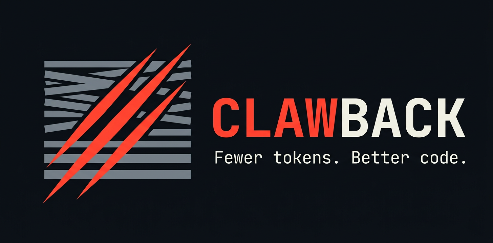

<div align="center">



**Clawback is a localhost proxy for Claude Code that trims every request before it reaches Anthropic, cutting token waste and keeping the model focused on your code.**

**One real turn went from ~33,600 to 8,216 billed tokens — about 4× lighter.** Less to pay for, more headroom before your rate limit, and a context window spent on your code.

`Local-only` · `Fail-open` · `No hosted service` · `Your logs never leave your machine`

[](https://github.com/Harmenszoon/clawback/actions/workflows/ci.yml)
[](https://www.python.org/)
[](LICENSE)

[Quickstart](#quickstart) · [The receipt](#the-receipt) · [Why it works](#why-smaller-context-matters) · [Safety](#built-to-fail-open)

</div>

---

## The receipt

Numbers from real captured traffic — one actual turn, a fresh session with a single user message:

| | Before *(reconstructed)* | After *(measured)* |
| --- | --- | --- |
| System prompt | ~27 KB (~6,750 tok) | **~280 chars (~70 tok)** |
| Tool definitions | ~33 tools (~23,000 tok) | **10 tools (~4,900 tok)** |
| Reminders | present | **0** |
| **Total request** | **~33,600 tokens** | **8,216 tokens** |

That's a **~75% smaller request — about 4× lighter** — with the model seeing only what the task needs. The *after* total (8,216) is the **exact** figure Anthropic billed; the *before* adds back the **measured** sizes of what Clawback removed.

> **Honest caveat:** most of that overhead is *cached*, and cache reads bill at ~10% — so this is **not** "75% cheaper." The reliable wins are fewer distractor tokens in the model's context, the eliminated Opus side-calls, and more headroom before your rate limit. The dollar savings are real but smaller than the token count suggests.

> **And at the other extreme:** in these same logs, long sessions reached **999,309** input tokens — a hair under the 1,000,000 cap. Un-trimmed, that turn would have blown past it and failed with `prompt is too long` (those 400s are in the logs, from before the proxy). Sometimes the ~25K Clawback shaves is the difference between *fits* and *fails*.

<details>
<summary><b>How we got these numbers</b></summary>

- The **"after"** numbers are real and exact: forwarded sizes are read straight from `logs/`, and 8,216 is the figure the Anthropic API actually billed (`usage`) for that turn.
- The **"before"** is reconstructed: Clawback only logs what it *forwards*, so the original isn't stored. We add back the measured sizes of what was stripped — the system-prompt delta (~27 KB observed → ~280 chars) and the dropped tool definitions (the full built-in set measured at ~90 KB / ~23K tokens in the same logs; `Workflow`'s description alone is ~18 KB). ~4 characters per token.
- Across turns, Clawback removes roughly **~25,000 tokens of fixed overhead per turn** — most of a short request, easing to a few percent once long conversation history dominates the payload.

</details>

## Quickstart

Three commands. No account, no hosted service, nothing leaves your machine.

```bash
git clone https://github.com/Harmenszoon/clawback
cd clawback
pip install -r requirements.txt
python -m clawback
```

Then point Claude Code at it and go:

```powershell
# PowerShell
$env:ANTHROPIC_BASE_URL = "http://localhost:3456"
claude
```
```bash
# bash / zsh
export ANTHROPIC_BASE_URL=http://localhost:3456
claude
```

`Ctrl+C` to stop. Requires Python 3.11+; the only runtime deps are `aiohttp` and `certifi`.

## What Clawback removes

Every time you press Enter, Claude Code ships a phone book of boilerplate to the API — on *every single turn*. Clawback strips it down to what matters and forwards everything else untouched:

| On every turn, Claude Code sends… | Clawback forwards… |
| --- | --- |
| A ~27 KB behavioral system prompt | The 3 lines that actually matter (working dir, platform, OS) + 1 directive → ~280 chars |
| The full tool set (~90 KB, dozens of tools) | Only the tools *you've* allowed |
| `<system-reminder>` blocks, re-injected every turn | Gone — and kept out of history too, so the prompt cache stays warm |
| A separate Opus call to title the chat + another to "recap" | Answered locally, instantly, for 0 tokens |

That's the ~25,000 tokens of fixed overhead, gone from every turn — and the model never has to read past it.

## Wait, isn't that there for a reason?

Mostly, no. We read through what Claude Code actually sends, and most of it is **accreted, not curated**. Here's a sample of what's on the chopping block — and why each one goes:

**18 KB for a tool it tells you not to use.** The `Workflow` tool ships an **18,000-character** description on *every* request — then says, in its own text: *"ONLY call this tool when the user has explicitly opted into multi-agent orchestration."* That's ~4,600 tokens a turn for a feature that, by its own rule, almost never runs.

**Your context window, used to advertise.** The `Bash` tool's description hard-codes instructions to end every commit with `Co-Authored-By: Claude Opus 4.8` and every PR with `🤖 Generated with Claude Code`. You pay for those tokens on every request — even if you never run a shell command — so the model can stamp Anthropic's branding into your git history.

**Nags about features you aren't using.** Every turn, Claude Code re-staples notes like *"The task tools haven't been used recently… consider using TaskCreate…"* and *"The date has changed… DO NOT mention this to the user, they are already aware."* If everyone already knows, repeating it to the model on every single turn is pure tax.

**Manuals for tools you've turned off.** All **33 built-in tools** ship their full definitions — about **23,000 tokens** — on every request: Cron, notebooks, worktrees, plan mode, and the rest, whether you'd ever allow them or not.

**Hand-holding written for weaker models.** Lines like Bash's *"IMPORTANT: Avoid using this tool to run `find`, `grep`, `cat`, `head`, `tail`, `sed`, `awk`, or `echo`…"* lecture a 2026 model against mistakes it wouldn't make. Opus 4.8 doesn't need the warning label; it needs the task.

None of this is incompetence. It's the cost of **one prompt that has to serve every model, every user, and every edge case at once** — reasonable for Anthropic to ship, wasteful for *you* to resend on every keystroke. Clawback re-tunes it for an audience of one: you, this machine, this model. And every cut is fail-open, so it's a safe bet — if something turns out to matter, it surfaces in your logs and you switch it back on.

## Why smaller context matters

Reclaiming context pays off twice:

**Cheaper.** Title and recap are full Opus inference calls — killed. Reminders that change every turn stop busting your prompt cache. On a Pro/Max plan it mostly buys you more headroom before your rate limit.

**Sharper.** This is the part caching *can't* fix. A cached token is still a token sitting in the context window, competing for the model's attention. Caching makes the clutter cheap; it doesn't make it invisible. Trimming it is one practical lever for keeping the model focused — and the research says that matters:

- **Lost in the Middle** (Liu et al., TACL 2024): accuracy follows a U-shape — a fact buried mid-context is recalled far less reliably than one near the edges, swinging results by double-digit points.
- **RULER** (NVIDIA, 2024): a model's *effective* context is often a fraction of its advertised window — only about half of tested models held up at 32K tokens. Extra tokens aren't free.
- **Context Rot** (Chroma, 2025 — tested on Claude 4 among others): accuracy degrades as input grows, even on simple tasks, and distractors make it measurably worse.

We deliberately don't slap a "+X% smarter" sticker on it — anyone who does is guessing. The precise, defensible version: the needle didn't change; we just shrank the haystack around it.

**References:** [Lost in the Middle](https://arxiv.org/abs/2307.03172) · [RULER](https://arxiv.org/abs/2404.06654) · [Context Rot](https://research.trychroma.com/context-rot)

## Built to fail open

A proxy that mangles your traffic is worse than no proxy. So every transform is **fail-open**:

- If it doesn't recognize something with certainty, it forwards your request **untouched**. The worst case is paying full price for one request — never a corrupted one.
- Detection keys off **structure** (JSON schema shape, tool names, Markdown landmarks), not wording — so an Anthropic copy-edit can't trip it.
- When detection *does* drift, the un-stripped content simply shows up in the log. That's your signal, not a silent failure.

Backed by **53 tests** running on Linux, macOS, and Windows across Python 3.11–3.13.

## It also un-wedges stuck sessions

With extended thinking + tool use, the API returns `thinking` blocks interleaved among `tool_use` blocks and requires them back in the exact same order (it cryptographically signs each one). Claude Code sometimes regroups them on resend — and the API rejects the whole turn with a 400, permanently wedging the session.

Clawback remembers the original order and restores it before forwarding. The repair is reorder-only, exact-match-or-nothing, and fails open on any doubt — so it can never make a request worse than the client already made it. You just stop hitting the wall.

## Everything is logged

Clawback writes a complete, human-readable record of every request and response — so you can finally answer *"what is Claude Code actually sending?"* by opening one file.

- `NNN_*.json` — the full structured record (the source of truth).
- `NNN_*.md` — a paired, readable rendering: system blocks sized and cache-flagged, a tool index, every message block annotated, usage breakdown.
- `index.jsonl` — one line per request to scan or grep.

Each record is flagged with whether Clawback intervened and how. Credentials and the `metadata.user_id` telemetry blob are redacted in the logs (but still forwarded upstream).

## You decide what the model sees

Which tools reach the model is entirely yours to decide, in a plain JSON file you edit at your leisure:

```json
{ "Read": true, "Edit": true, "WebSearch": true, "Bash": false, "TaskCreate": false }
```

- Edits take effect on the **next request** — no restart.
- A tool Clawback has never seen defaults to allowed and is added to the file, so nothing ever breaks silently — it just shows up for you to decide.
- Writes are atomic; a broken file fails safe (allow-all + a warning, never a silent wipe of your config).

Start from the checked-in [`tools.json.example`](tools.json.example).

## How it works

```
                       ┌──────────────┐
   claude  ──HTTP──▶   │   Clawback   │   ──HTTP──▶  api.anthropic.com
                       │  (localhost) │
                       └──────┬───────┘
                              │
   ┌──────────────┬───────────┴──────────┬──────────────────┐
   ▼              ▼                       ▼                  ▼
 short-circuit  mutate request        repair               log
 (title, recap) (shrink prompt,    (restore thinking     (JSON + Markdown
  → answered    filter tools,        block order)         + index)
   locally)     strip reminders)
```

For each request Clawback either (1) **answers it locally** if it's a known auxiliary call (title, recap), or (2) **slims it** (reduce the system prompt, filter tools, strip reminders), repairs any reordered thinking blocks, forwards it, and streams the reply back **byte-for-byte** while assembling a copy for the log.

| Transform | What it does |
| --- | --- |
| `title-gen` *(short-circuit)* | Detects the title-request schema and returns a synthetic `CONVERSATION_<hex>` — no upstream call. |
| `recap` *(short-circuit)* | Detects the "user stepped away" prompt and returns `"Continuing."` instead of paying Opus to summarize. |
| `reduce-main-system` | Replaces the ~27 KB behavioral prompt with the operational env lines + one tool-selection directive. |
| `filter-tools` | Drops tools disabled in `tools.json`; auto-discovers new ones; never drops a tool the request *forces* via `tool_choice`. |
| `strip-system-reminders` | Removes injected reminders in all three forms (standalone blocks, inline in tool results, and `role:"system"` messages), consistently across history so the cache prefix holds. |
| `restore-thinking-order` *(repair)* | Undoes Claude Code's interleaved-thinking reordering using the original order Clawback recorded. |

## Configuration

All settings are environment variables (optionally from a `.env` file):

| Variable | Default | Description |
| --- | --- | --- |
| `PROXY_HOST` | `localhost` | Bind address |
| `PROXY_PORT` | `3456` | Listen port |
| `PROXY_TARGET_URL` | `https://api.anthropic.com` | Upstream API endpoint |

## FAQ

**Will it break Claude Code?**
No transform mutates a request it isn't certain about — it fails open and forwards the original. The worst case is a missed optimization, never a broken request.

**Does it phone home or read my data?**
It runs entirely on your machine. Nothing leaves except the (slimmer) request to Anthropic you were already making. Your credentials pass straight through; logs stay local and are gitignored.

**Will it slow me down?**
It's an async passthrough. Transforms are microseconds; the upstream call is seconds. Streaming responses are forwarded chunk-by-chunk, unchanged.

**Does it work with my MCP servers / OS / tool setup?**
Yes. `tools.json` is yours; unknown tools default to allowed and appear in the file for you to decide. Swap `PowerShell` for `Bash` off Windows.

**Is it safe to run?**
It's a localhost, single-user tool with no auth, and its logs contain your prompts and tool output. Keep it bound to `localhost` and don't publish logs raw. See [SECURITY.md](SECURITY.md).

## Design principles

- **Detect structurally, never on prose.** Schema shapes and tool names are contracts; the sentences around them are not.
- **Fail open, never silently break.** A missed optimization is cheap; a corrupted request is not.
- **Copy-on-write.** Transforms never mutate the object they receive.
- **The user is the policy.** `tools.json` decides; Clawback never pre-judges.
- **Exhaustive logs by default.** If you can't see it, you can't trim it.

## Project layout

```
clawback/
  __main__.py        entry point (python -m clawback); tees output to console.log
  server.py          aiohttp app + the request handler that drives the pipeline
  transforms.py      short-circuits + mutations (title, recap, reduce, strip, filter)
  thinking_order.py  stateful repair for the interleaved-thinking reorder bug
  tool_filter.py     dynamic tools.json allowlist with atomic writes
  sse.py             SSE stream assembler (observation-only, for the log)
  log.py / render.py per-run logging + JSON→Markdown rendering
  config.py          env loading, paths, header filters
tests/               pytest suite (transforms, SSE, repair, redaction, async handler)
.github/             CI + issue/PR templates
assets/              logo / banner images
```

## Development

```bash
pip install -r requirements-dev.txt
python -m pytest          # 53 tests, no network needed
ruff check . && ruff format --check .
```

See [CONTRIBUTING.md](CONTRIBUTING.md) for the design rules and how to add a transform. The same gates run in CI across three OSes and Python 3.11–3.13.

## License

[The Unlicense](LICENSE) — public domain. Do whatever you want with it; no attribution required.

---

<div align="center">
<sub>Clawback is an independent project and is not affiliated with or endorsed by Anthropic.</sub>
</div>
